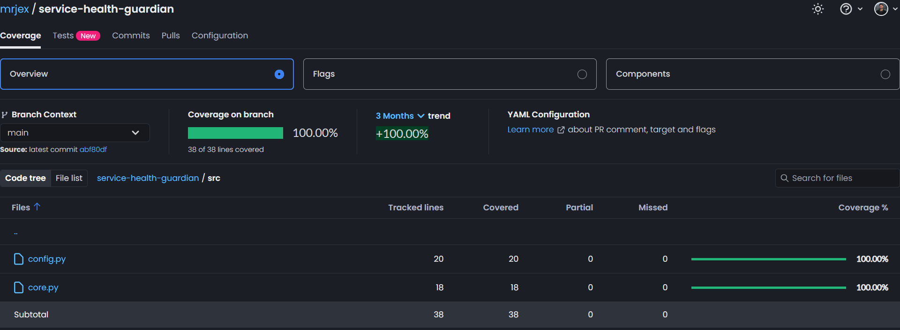
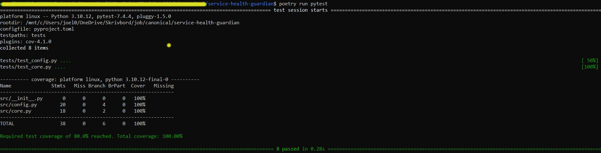

# Service Health Guardian

[](https://codecov.io/gh/YOUR_USERNAME/service-health-guardian)
[](https://github.com/psf/black)
[](https://github.com/astral-sh/ruff)

> A CLI tool that monitors `systemd` services using `systemctl` and `journalctl` commands.


## Get Started

1. Check the available services on your system:

```bash
# List all active services
systemctl list-units --type=service --state=active

# List ALL services (including inactive)
systemctl list-units --type=service --all
```

2. Add services to `config/guardian.yaml`

```yaml
services:
  - cron
  - snapd
  - sshd
  - nginx
  - ...
```

3. Setup virtual environment:

```bash
poetry lock

poetry install
```

4. Run service:

```bash
poetry run service-health-guardian --help
poetry run service-health-guardian --config config/guardian.yaml
```


## Tests

*CI pipeline artifacts in **CodeCov**:*




*Code coverage tests **locally**:*


